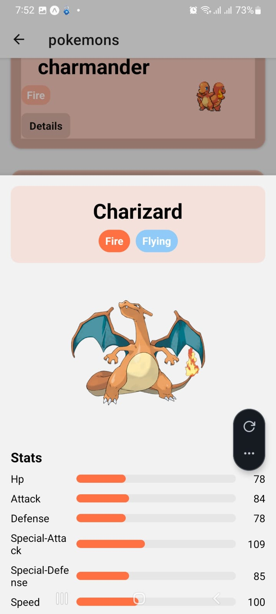

# 📱 Pokémon List App

A simple mobile app built with **Expo (React Native)** that displays a list of Pokémon fetched from the **PokéAPI**.  
Users can browse Pokémon, view sprites, and enjoy a clean, smooth UI.

---

## 🚀 Live App

Try the app in **Expo Go**:  
[Open Pokémon App](https://expo.dev/accounts/uswa-jamil/projects/my-app)

---

## 🧩 Features

- Fetches real Pokémon data from **PokéAPI**  
- Displays Pokémon names and images  
- Smooth scrolling list  
- Clean mobile-friendly UI  
- Works on **iOS** and **Android**  
- Built with **Expo and React Native**

---
## 📸 Screenshots

**Home Screen**

**Detail Screen**

**List Screen**

